

[![java][java-shield]][java-url]
[![BSD3 License][license-shield]][license-url]
[![Downloads][downloads-shield]][downloads-url]
[![Stars][stars-shield]][stars-url]
[![Plankness][plankness-shield]][plankness-url]

 

  

Repository della nostra soluzione per la Tablut Challenge 2022 organizzata per il corso di
<a href="https://www.unibo.it/it/didattica/insegnamenti/insegnamento/2021/468002">Fondamenti di Intelligenza Artificiale M</a>.
Per maggiori informazioni sulle regole del gioco, sulle regole della competizione e sulla strategia adottata, clicca
<a href="./About.md">qui</a>.
  
<a href="https://www.youtube.com/watch?v=G2NjmWRps28">Ascolta sto banger</a>

### Esecuzione del Player
---

<table>
  <tr width="100%">
    <td width="69%">
      <ol>
        <li>Download the <a href="https://github.com/Gionnino9000/Gionnino9000/releases/latest">latest release</a> of our player Tavoletta</li>
        <li>Launch the Server</li>
        <li>Launch the Player with the following parameters: <code>&#60;WHITE|BLACK></code> <code>[&#60;timeout>]</code> <code>[&#60;ip_address>]</code> 
          (es. <code>java -jar ./Tavoletta.jar WHITE 60 localhost</code>)</li>
        <li>Launch a second player, for example a random or human client, or another player</li>
        <li>Have fun!</li>
      </ol>
    </td>
    <td align="center" width="30%">
      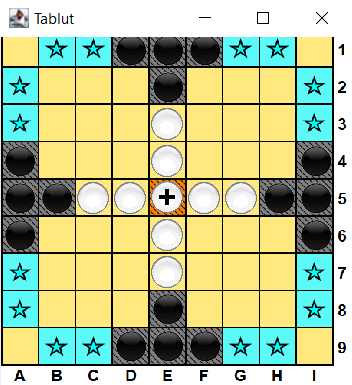
      Demo velocizzata
   </td>
  </tr>
</table>

<!--
Non so che caBBo di problema abbiano le GIF, ma si rompe l'align, quindi tocca fare sto aborto in raw HTML

1. Download the [latest release](https://github.com/Gionnino9000/Gionnino9000/releases/latest) of our player Tavoletta
2. Launch the Server
3. Launch the Player with the following parameters: `<WHITE|BLACK>` `<timeout>` `<ip_address>`
  (ex. `java -jar ./Tavoletta.jar WHITE 60 localhost`)
4. Launch a second player, for example a random or human client, or another player
5. Have fun!
-->

### Spiegazione del Nome
---
- Tablut = Tavoletta
- Tavoletta = l'Amico immaginario di Jonnino in **Ed, Edd & Eddy**
- Jonnino -> Gionnino (assolutamente non perché abbiamo sbagliato a scrivere il nome quando ci siamo iscritti)
- 9000 = piccola **nerd reference** a 2001 Odissea nello Spazio, **HAL9000**

*Fine della Spiegazione del Nome* 

Quindi in pratica fra, cioè stavamo tipo scegliendo il nome (assurdo cioè non puoi capire), quando all'improvviso mi sono ricordato che quel chad di Danny Antonucci aveva fatto tipo un [masterpiece](https://en.wikipedia.org/wiki/Ed,_Edd_n_Eddy). E allora ho assolutamente dovuto sussare un nome zio, ho dovuto mostrare un po' di drip, no cap my G, only flames 🥶 e ho droppato sto pezzo di nome gigante bro, figata. Perché praticamente vez, noi così siamo il team Gionnino9000, e tipo il nostro player è Tavoletta. Capito bel? Perché gioca a Tablut, troppo figata, sigma grindset, basato fattuale.

### Membri del Team
---
- [Federico Andrucci](https://github.com/Federicoand98)
- [Karina Chichifoi](https://github.com/TryKatChup)
- [Alex Gianelli](https://github.com/Noesh)
- [Michele Righi](https://github.com/mikyll)

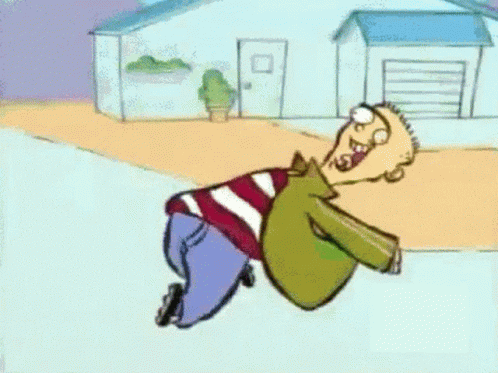

### Setup
---
Per il setup fare riferimento a [questo documento](./Setup.md).

### Premi speciali
---
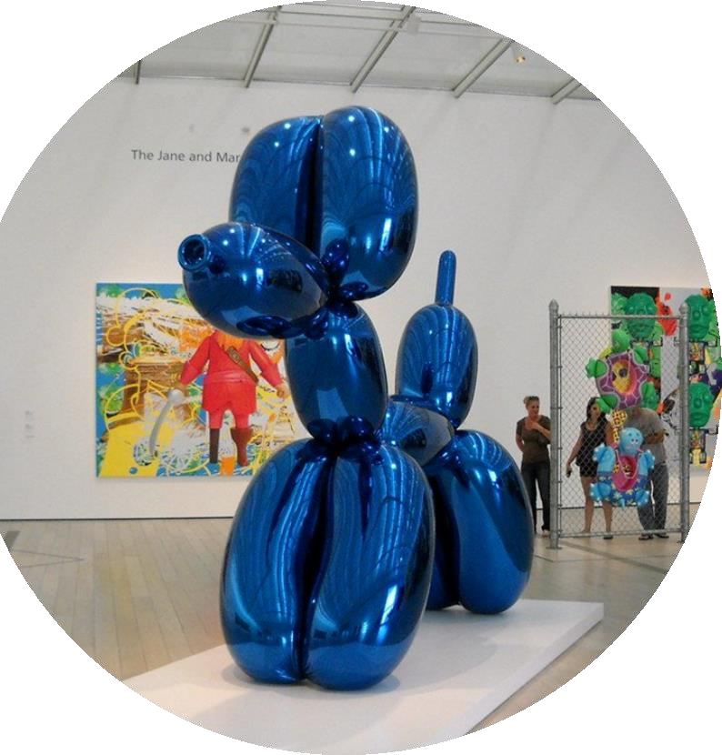

#### Contemporary Art
You know why.

### Licenza
---
Distribuito sotto Licenza BSD 3-Clause. Vedi [`LICENSE`](./LICENSE) per maggiori informazioni.

### Migliori Team degli Anni Precedenti
---

[History & Hall of Fame](./History.md).

### Riferimenti
---
- [Sito Challenge](http://ai.unibo.it/games/boardgamecompetition/tablut)
- [An Upper Bound on the Complexity of Tablut](http://ai.unibo.it/sites/ai.unibo.it/files/Complexity_of_Tablut_2.pdf)
- [Tablut Tactics](https://github.com/mikyll/TablutTactics)

### Memoni Giganti
---

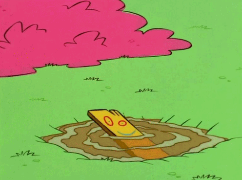
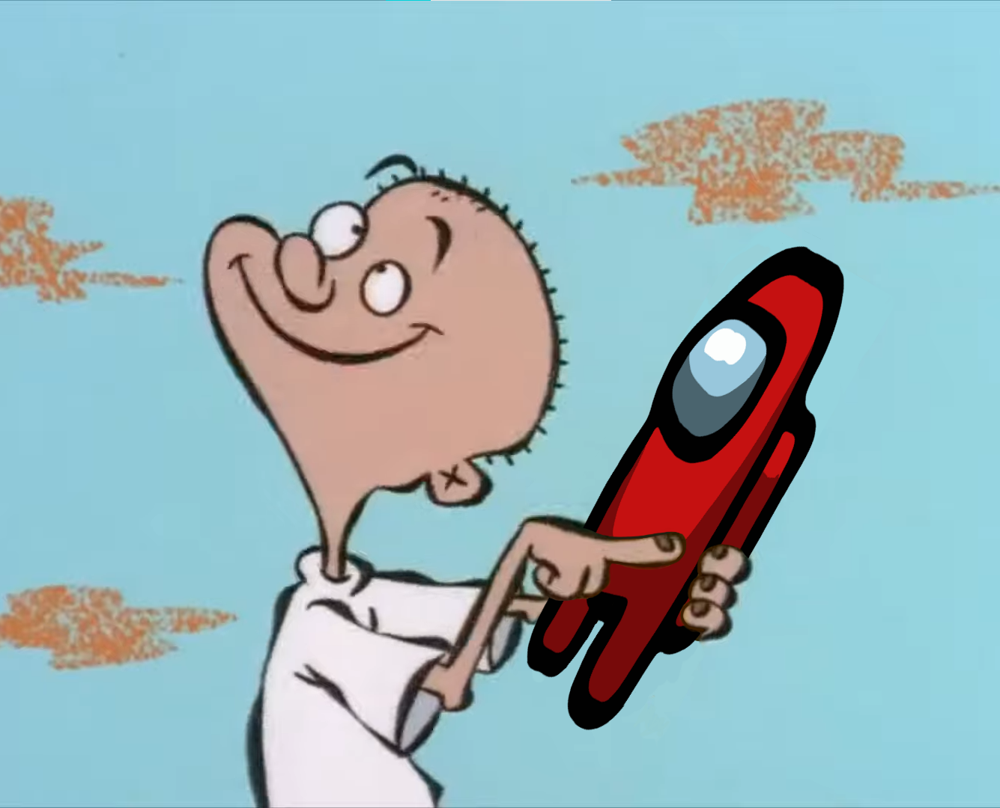
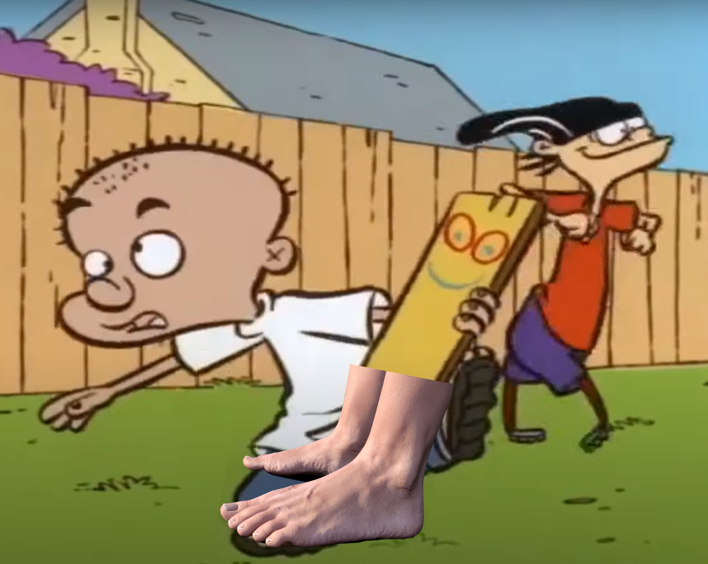
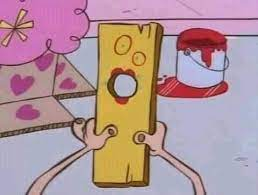
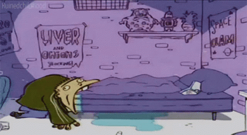

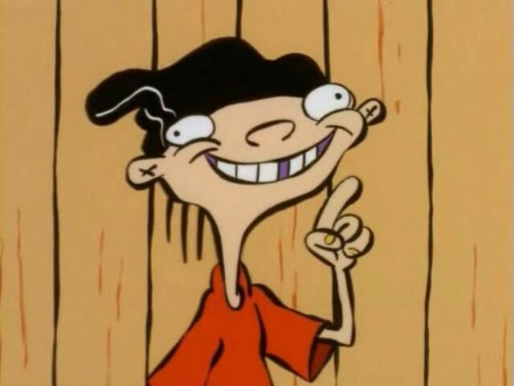
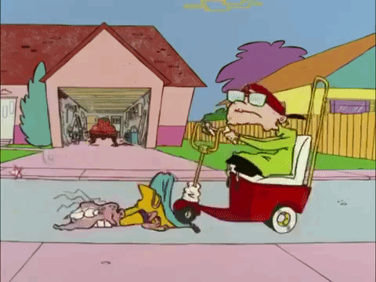
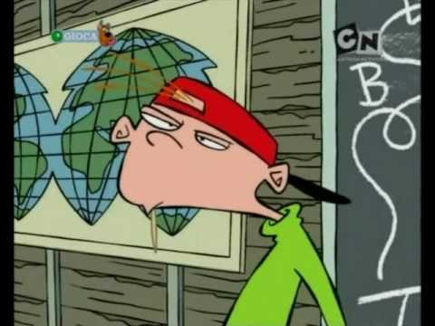
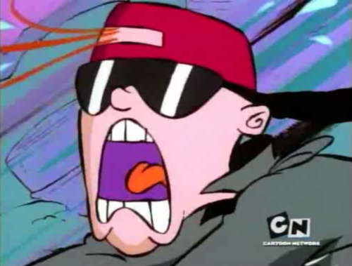
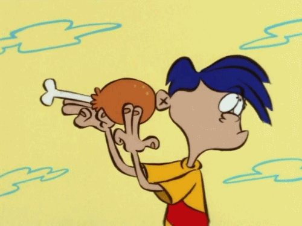

[java-shield]: https://img.shields.io/badge/Java-ED8B00?logo=java&logoColor=white
[java-url]: https://www.java.com
[downloads-shield]: https://img.shields.io/github/downloads/Gionnino9000/Gionnino9000/total
[downloads-url]: https://github.com/Gionnino9000/Gionnino9000/releases/latest
[license-shield]: https://img.shields.io/github/license/Gionnino9000/Gionnino9000
[license-url]: https://github.com/Gionnino9000/Gionnino9000/blob/main/LICENSE
[stars-shield]: https://custom-icon-badges.herokuapp.com/github/stars/Gionnino9000/Gionnino9000?logo=star&logoColor=yellow
[stars-url]: https://github.com/Gionnino9000/Gionnino9000/stargazers
[plankness-shield]: https://custom-icon-badges.herokuapp.com/badge/plankness-100%25-yellow?logo=plankness&logoColor=yellow
[plankness-url]: https://github.com/Gionnino9000/Gionnino9000/blob/main/gfx/GionninoTavoletta/WidePlank.gif
